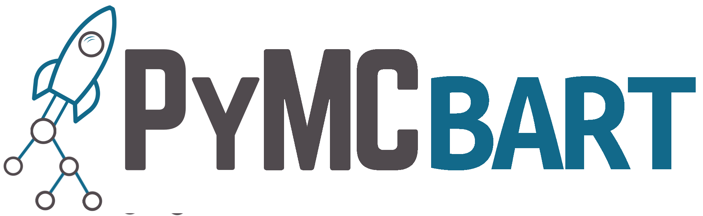

# Bayesian Additive Regression Trees for Probabilistic Programming with PyMC



PyMC-BART extends [PyMC](https://github.com/pymc-devs/pymc) probabilistic programming framework to be able to define and solve models including a BART random variable. PyMC-BART also includes a few helpers function to aid with the interpretation of those models and perform variable selection.

## Table of Contents

- [Installation](#installation)
- [Usage](#usage)
- [Contributions](#contributions)
- [Code of Conduct](#code-of-conduct)
- [Citation](#citation)
- [License](#license)
- [Donations](#donations)
- [Sponsors](#sponsors)


## Installation

PyMC-BART is available on Conda-Forge. If you magange your Python dependencies and environments with Conda, this is your best option. You may also perfer to install this way if you want an easy-to-use, isolated setup in a seperate environment. This helps avoid interfering with other projects or system-wide Python installations. To set up a suitable Conda environment, run:

```bash
conda create --name=pymc-bart --channel=conda-forge pymc-bart
conda activate pymc-bart
```

Alternatively, you can use pip installation. This installation is generally perfered by users who use pip, Python's package installer. This is the best choice for users who are not using Conda or for those who want to install PyMC-BART into a virtual environment managed by venv or virtualenv. In this case, run:

```bash
pip install pymc-bart
```

In case you want to upgrade to the bleeding edge version of the package you can install from GitHub:

```bash
pip install git+https://github.com/pymc-devs/pymc-bart.git
```

## Usage

Get started by using PyMC-BART to set up a BART model:

```python
import pymc as pm
import pymc_bart as pmb

X, y = ... # Your data replaces "..."
with pm.Model() as model:
    bart = pmb.BART('bart', X, y)
    ...
    idata = pm.sample()
```

## Contributions
PyMC-BART is a community project and welcomes contributions.
Additional information can be found in the [Contributing Readme](https://github.com/pymc-devs/pymc-bart/blob/main/CONTRIBUTING.md)

## Code of Conduct
PyMC-BART wishes to maintain a positive community. Additional details
can be found in the [Code of Conduct](https://github.com/pymc-devs/pymc-bart/blob/main/CODE_OF_CONDUCT.md)

## Citation
If you use PyMC-BART and want to cite it please use [](https://arxiv.org/abs/2206.03619)

Here is the citation in BibTeX format

```
@misc{quiroga2023bayesian,
title={Bayesian additive regression trees for probabilistic programming},
author={Quiroga, Miriana and Garay, Pablo G and Alonso, Juan M. and Loyola, Juan Martin and Martin, Osvaldo A},
year={2023},
doi={10.48550/ARXIV.2206.03619},
archivePrefix={arXiv},
primaryClass={stat.CO}
}
```

## License

[Apache License, Version 2.0](https://github.com/pymc-devs/pymc-bart/blob/main/LICENSE)

## Donations
PyMC-BART , as other pymc-devs projects, is a non-profit project under the NumFOCUS umbrella. If you want to support PyMC-BART financially, you can donate [here](https://numfocus.org/donate-to-pymc).

## Sponsors
[](https://numfocus.org)
